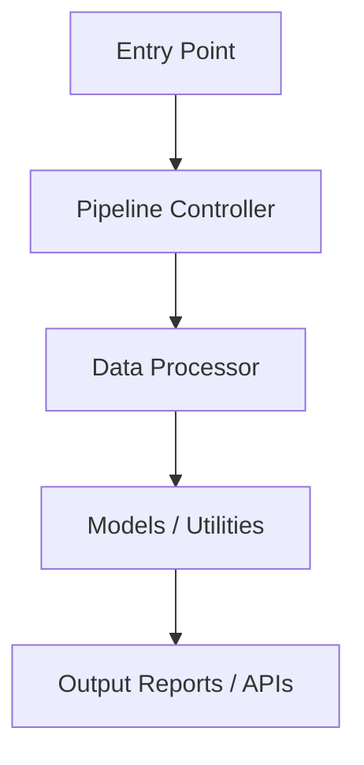

# piper-yt-automation

piper-yt-automation is a YouTube Shorts generator scripting suite.
Orchestrates script generation, Edge TTS voiceovers, Whisper subtitles, and FFmpeg video assembly.

## Setup Instructions

### 1. Prerequisites
- Ensure you have python 3.10+ or Node.js runtime installed depending on component codebase.
- Ensure your environment variables are configured. Copy `.env.example` to `.env` if present.

### 2. Installation
```bash
# Clone/Open this folder and configure dependencies
pip install -r requirements.txt
```

### 3. Execution
Run the primary script or configuration utility. Refer to individual source modules for specific CLI parameters.

## Architecture


